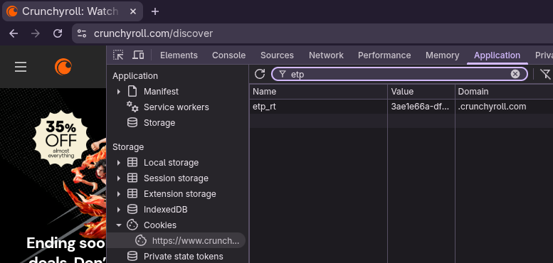

# Crunchyroll Downloader API

**Made by Zenova (Taimiya Amjad)**

**A Huge Shoutout to CuteTenshii for the Existing Project**

[](https://github.com/taimiyaamjad/crunchyroll-downloader-api/actions/workflows/tests.yml)
[](https://github.com/taimiyaamjad/crunchyroll-downloader-api/releases/latest)
[](go.mod)
[](LICENSE.txt)

Downloads anime from Crunchyroll and outputs an MKV file — either from the
command line or through a small **searchable HTTP API** that serves the finished
video straight to your browser.

> **New here?** Jump to [Full setup from scratch](#full-setup-from-scratch) for
> step-by-step instructions (installing Go, FFmpeg, the Widevine CDM and your
> Crunchyroll token).

## Features

- Supports choosing the audio and subtitle language, including downloading multiple of each into a single file
- Supports choosing the audio and video quality
- Decrypts Widevine DRM (requires: a `.wvd` file, or `client_id.bin` and `private_key.pem`)
- Adds metadata (like episode name) to the MKV container
- Parallel segment downloads (10 workers) for faster downloads
- Retry with backoff on connection errors
- Batch download from a list of URLs
- **HTTP API** with search and on-demand download that streams the video to the browser
- **Automatic cleanup** — API downloads are deleted 10 minutes after they finish, so disk space is freed without any manual work

## Requirements

- [Go](https://go.dev/dl/) **1.25 or newer** (only to build — not needed to run a prebuilt binary)
- [FFmpeg](https://www.ffmpeg.org/download.html#get-packages)
- To download Premium-only content, a Crunchyroll Premium account. (This can't be bypassed; a free trial is enough.)
- Either a `.wvd` file, or a `client_id.bin` and `private_key.pem` (already included in this repo)

---

## Full setup from scratch

This walks you through everything: installing Go, getting the code, installing
FFmpeg, adding the Widevine CDM and finally grabbing your Crunchyroll token.

### Step 1 — Install Go (1.25+)

Go is the language this project is written in. You only need it to **build** the
program.

**Windows**

1. Download the installer (`.msi`) from <https://go.dev/dl/>.
2. Run it and accept the defaults (it installs to `C:\Program Files\Go`).
3. Close and reopen your terminal, then check:
   ```shell
   go version
   ```
   You should see something like `go version go1.25.0 windows/amd64`.

**macOS**

- Easiest with Homebrew:
  ```shell
  brew install go
  ```
- Or download the `.pkg` installer from <https://go.dev/dl/> and run it.
- Verify:
  ```shell
  go version
  ```

**Linux**

- Many distros have an old Go, so install it from the official tarball:
  ```shell
  # Pick the latest version from https://go.dev/dl/ and replace the URL below
  curl -LO https://go.dev/dl/go1.25.0.linux-amd64.tar.gz
  sudo rm -rf /usr/local/go
  sudo tar -C /usr/local -xzf go1.25.0.linux-amd64.tar.gz
  export PATH=$PATH:/usr/local/go/bin
  go version
  ```

  To make the `PATH` change permanent, add this line to `~/.bashrc` (or `~/.zshrc`):
  ```shell
  export PATH=$PATH:/usr/local/go/bin
  ```

> **`go: command not found`?** Go is installed but its `bin` folder isn't on your
> `PATH`. On Windows re-open the terminal (or add `C:\Program Files\Go\bin` to
> *Environment Variables → Path*). On Linux/macOS add the `export PATH=...` line
> above and run `source ~/.bashrc`.

### Step 2 — Get the project

Either clone the repository:

```shell
git clone https://github.com/taimiyaamjad/crunchyroll-downloader-api.git
cd crunchyroll-downloader-api
```

Or download the ZIP from GitHub, extract it, and open a terminal in that folder.

### Step 3 — Build it

From inside the project folder:

```shell
go build .
```

This downloads the dependencies automatically and produces the
`crunchyroll-downloader` executable (`.exe` on Windows) in the same folder.

> If you don't want to build it yourself, check the
> [latest release](https://github.com/taimiyaamjad/crunchyroll-downloader-api/releases/latest)
> for a prebuilt binary for your OS.

### Step 4 — Install FFmpeg

FFmpeg merges the separately downloaded audio, video and subtitle tracks into the
final MKV file.

**Windows**
1. Download a build from <https://www.gyan.dev/ffmpeg/builds/> (or the
   [official download page](https://www.ffmpeg.org/download.html#get-packages)).
2. Extract it and add its `bin` folder to your `PATH`
   (*Environment Variables → Path*), or place `ffmpeg.exe` next to the
   `crunchyroll-downloader` binary.
3. Verify:
   ```shell
   ffmpeg -version
   ```

**macOS**
```shell
brew install ffmpeg
```

**Linux (Debian/Ubuntu)**
```shell
sudo apt update && sudo apt install ffmpeg
```

**Linux (Fedora)**
```shell
sudo dnf install ffmpeg
```

Verify with `ffmpeg -version`.

### Step 5 — Get a Widevine CDM file

Crunchyroll serves its video DRM-protected, so the downloader needs a Widevine
CDM to request the decryption keys. You need **either**:

- a single `.wvd` file, **or**
- a `client_id.bin` and a `private_key.pem` pair.

This repository already includes a `client_id.bin` and `private_key.pem`, so you
can start right away. If they ever stop working (CDMs get revoked), you can
extract your own from a rooted Android device or search for *"ready to use
cdms"* and download a fresh `.wvd`. Place the file(s) in the folder you run the
program from.

### Step 6 — Get your `etp_rt` cookie

The `etp_rt` cookie is what authenticates the downloader as **your** Crunchyroll
account (needed for Premium content).

1. Log in to <https://www.crunchyroll.com> in your browser.
2. Open Developer Tools:
   - Windows/Linux: `Ctrl + Shift + I`
   - macOS: `Cmd + Option + I`
3. Open the storage tab:
   - **Firefox:** *Storage* → *Cookies*
   - **Chrome / Edge / Brave:** *Application* → *Storage* → *Cookies*
4. Select the `crunchyroll.com` domain.
5. Find the cookie named **`etp_rt`** and copy its **value** (a long string).



Keep this value private — it grants access to your account.

### Step 7 — Run it

**Command line (single episode):**

```shell
./crunchyroll-downloader --url https://www.crunchyroll.com/watch/GE00198973JAJP/dawn-and-confusion --etp-rt replace_this
```

**HTTP API server:**

```shell
./crunchyroll-downloader -serve -addr :8080 -etp-rt replace_this
```

Then open the API in Chrome — see [HTTP API](#http-api-search--download) below.

---

## Usage (command line)

Run the program with the options you want:

```text
Usage of ./crunchyroll-downloader:
  -audio-lang string
        Audio language(s), comma-separated for multiple (e.g. "ja-JP,en-US"). First is the default track (default "ja-JP")
  -audio-quality string
        Audio quality (default "192k")
  -cc-lang string
        Closed caption language(s), comma-separated for multiple (e.g. "en-US"). Downloaded in addition to --subs-lang, not instead of it
  -debug-manifest
        Log raw episode playback JSON and manifest XML
  -download-delay duration
        Minimum delay between episode downloads, to help avoid Crunchyroll's rate limiting (e.g. "30s", "2m")
  -etp-rt string
        The "etp_rt" cookie value of your account
  -file string
        Path to a text file with one URL per line
  -season int
        Season number. Not used if an episode link is entered
  -subs-lang string
        Subtitle language(s), comma-separated for multiple (e.g. "en-US,es-419"). First is the default track (default "en-US")
  -url string
        URL of the episode/season to download
  -video-quality string
        Video quality (default "1080p")
```

Ex: to download the first season of *Hell's Paradise*:

```shell
./crunchyroll-downloader --url https://www.crunchyroll.com/series/GJ0H7Q5ZJ/hells-paradise --season 1 --etp-rt replace_this
```

To download a specific episode:

```shell
./crunchyroll-downloader --url https://www.crunchyroll.com/watch/GE00198973JAJP/dawn-and-confusion --etp-rt replace_this
```

To batch download from a file (one URL per line):

```shell
./crunchyroll-downloader --file list.txt --etp-rt replace_this --subs-lang pt-BR
```

To download multiple audio tracks and subtitles into a single file (the first of each is set as the default track). If any requested language is missing for an episode, that episode is skipped:

```shell
./crunchyroll-downloader --url https://www.crunchyroll.com/watch/GE00198973JAJP/dawn-and-confusion --etp-rt replace_this --audio-lang ja-JP,en-US --subs-lang en-US,es-419,de-DE
```

If you're getting rate-limited while downloading a season/batch, wait at least this long between each episode:

```shell
./crunchyroll-downloader --url https://www.crunchyroll.com/series/GJ0H7Q5ZJ/hells-paradise --season 1 --etp-rt replace_this --download-delay 30s
```

If Crunchyroll rate-limits an episode anyway, it's retried in place (starting at `-download-delay`, or 1 minute if unset, doubling up to 30 minutes on repeated hits) instead of moving on to the next episode and tripping the same limit again.

## HTTP API (watch, download & search)

Instead of the one-shot CLI, run a small HTTP API that searches Crunchyroll,
**streams anime directly online in your browser** (`/api/watch`), and downloads
single episodes or entire seasons (`/api/download`). Downloads are written to a
temporary directory and **deleted 10 minutes after they finish**, so you don't
have to clean up space by hand.

Start the server:

```shell
./crunchyroll-downloader -serve -addr :8080 -etp-rt replace_this
```

### 1. Watch Online Directly in Chrome (`/api/watch`)

To stream an anime online directly in your browser:

```text
http://localhost:8080/api/watch?https://www.crunchyroll.com/watch/GE00198973JAJP?language=hi? quality=1080p
```

Or using standard parameters:

```text
http://localhost:8080/api/watch?url=https://www.crunchyroll.com/watch/GE00198973JAJP&language=hi&quality=1080p
```

- **Hindi Dubs**: Use **`hi`** as the short code (automatically maps to `hi-IN`).
- **Inline Streaming**: Streams video with `Content-Disposition: inline` and HTTP range support so you can seek instantly.
- **Web Player**: Add `&player=1` to watch in a responsive HTML5 video player with episode title, series metadata, and download link.

### 2. Download Whole Season or Single Episode (`/api/download`)

To download a single episode:

```text
http://localhost:8080/api/download?url=https://www.crunchyroll.com/watch/GE00198973JAJP&language=hi&quality=1080p
```

To download an **entire season** (served as a single `.zip` file containing all episodes):

```text
http://localhost:8080/api/download?url=https://www.crunchyroll.com/series/GJ0H7Q5ZJ/hells-paradise&season=1&language=hi&quality=1080p
```

Or in terse format:

```text
http://localhost:8080/api/download?https://www.crunchyroll.com/series/GJ0H7Q5ZJ?season=1?language(hi)?1080p
```

### Endpoints

| Endpoint | Description |
| --- | --- |
| `GET /` | JSON index of available endpoints and examples |
| `GET /api/health` | Uptime, active jobs and number of tracked files |
| `GET /api/search?q=<title>&limit=10` | Search Crunchyroll series, seasons and episodes with ready-to-use URLs |
| `GET /api/watch?...` | Directly stream an episode online in Chrome (inline video or web player with `&player=1`) |
| `GET /api/download?...` | Download single episode (MKV) or whole season (ZIP) |
| `GET /api/file/<job_id>` | Re-download or stream (`?inline=1`) a finished job while it still exists |

### Request Parameters (`/api/watch` & `/api/download`)

| Parameter | Default | Description |
| --- | --- | --- |
| `url` (or `episode`, `ep`, `series`) | — | Crunchyroll `/watch/` episode URL or `/series/` URL |
| `language` (or `lang`, `audio`) | episode's primary dub | Language code: **`hi`** (Hindi / `hi-IN`), `en` (`en-US`), `ja` (`ja-JP`), etc. |
| `quality` (or `res`) | `1080p` | `1080p`, `720p`, `480p`, `360p` |
| `season` (or `s`) | `1` (for series) | Season number to download (e.g. `1`, `2`, or `all`) |
| `player` | `false` | When set to `1` on `/api/watch`, displays the built-in HTML5 web player |
| `audio_quality` | `192k` | Audio bitrate |
| `subs` / `cc` | `-subs-lang` / `-cc-lang` values | Comma-separated subtitle / caption locales |
| `etp_rt` | server account | Override the account for this one request |
| `format=json` | stream / file | Return JSON descriptor with file link instead of the media body |

### Server flags

```text
-serve                 Run the HTTP API instead of the one-shot CLI
-addr :8080            Address to listen on
-api-dir <path>        Directory for API downloads (default: <system temp>/crdl-api)
-cleanup-after 10m     Delete each download this long after it finishes
-max-jobs 2            Maximum concurrent downloads
```


If no `-etp-rt` is given at startup, clients must pass `etp_rt=...` on each
request (or the server returns `401`). The token is refreshed automatically
mid-download if Crunchyroll expires it.

**Note:** You still need FFmpeg and a Widevine CDM (`.wvd`, or `client_id.bin` +
`private_key.pem`) as described above — the API is a wrapper around the same
downloader.

### How the automatic cleanup works

Every API download goes into its own temporary folder and is given an expiry time
`-cleanup-after` (default **10 minutes**) after it finishes. A sweeper runs every
30 seconds and deletes expired downloads, even if the client never comes back to
fetch the file. Files still being streamed are kept alive until the transfer
ends, and `/api/file/<job_id>` stops working once the file has been deleted.
Change the window with, for example, `-cleanup-after 30m`.

## Building

### Requirements

- [Go](https://go.dev/dl/) 1.25 or newer

### Guide

- Clone this repository
- Open a Terminal/Command prompt, and go to the folder where you cloned the repo
- Run `go build .`

---

## Help

### `go: command not found`

Go isn't on your `PATH`. See [Step 1](#step-1--install-go-125) above — re-open
your terminal after installing, or add Go's `bin` folder to `PATH` manually.

### How do I get my `etp_rt` cookie?

- Go to <https://crunchyroll.com> and log in
- Open Developer Tools
- Firefox: Go to *Storage* then *Cookies*<br />Chrome: Go to *Application* then *Cookies*
- Select the Crunchyroll domain, then copy the `etp_rt` cookie value


### What is a `.wvd` file and do I really need one?

Yes, Crunchyroll uses DRM-only content. This file is used to get a Widevine license, which gives the keys to decrypt the media.

If you don't have a rooted Android device or are just lazy, search "ready to use cdms" and you'll find plenty of websites providing those files.

### `ffmpeg: command not found`

FFmpeg isn't installed or isn't on your `PATH`. See [Step 4](#step-4--install-ffmpeg).
On Windows you can also drop `ffmpeg.exe` in the same folder as the downloader.

### The API returns `401`

No valid token was found. Pass `-etp-rt <cookie>` when starting the server, or add
`&etp_rt=<cookie>` to the request URL.

## License

This project is licensed under the MIT License. See [LICENSE.txt](LICENSE.txt).

---

Made with ❤️ by **Zenova (Taimiya Amjad)**.
